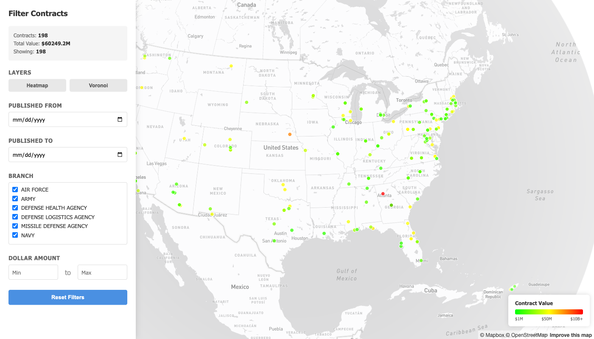
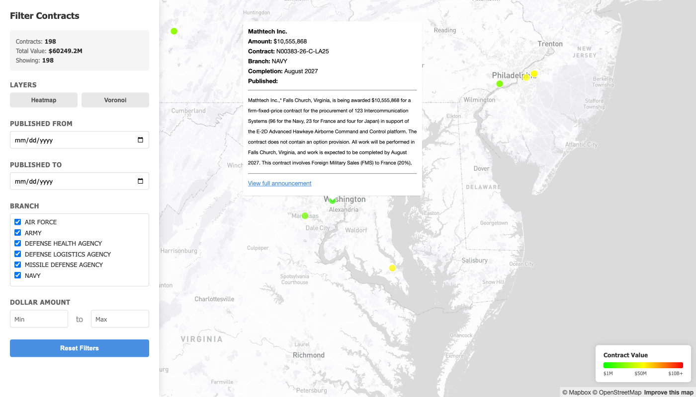
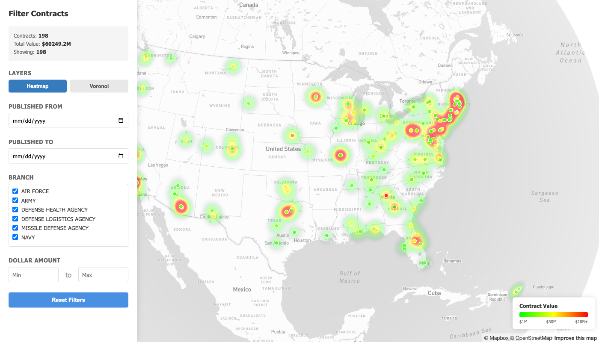
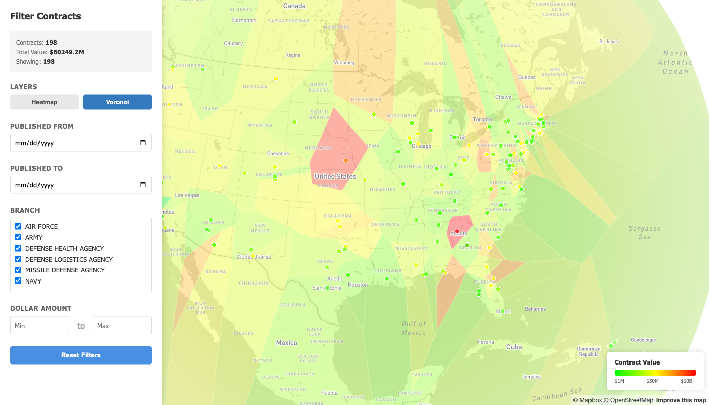

# DOD Contract Scanner

## Overview

dod-scan is a comprehensive pipeline for scraping, parsing, classifying, geocoding, and exporting U.S. Department of Defense contract awards from war.gov. It fetches daily contract announcements, extracts structured data from HTML, uses an LLM to classify contracts as procurement or service contracts, resolves locations to geographic coordinates, and exports results as interactive KML maps and Mapbox dashboards.



## Requirements

- **[uv](https://docs.astral.sh/uv/)** — Fast Python package manager (handles Python, venvs, and dependencies)
- **Google Chrome** — Required for scraping (war.gov blocks headless browsers; Playwright uses system Chrome)
- **LLM API access (required for classification)** — Anthropic or OpenRouter
- **Mapbox account (optional)** — For interactive HTML map dashboards; KML export works without it

## Installation

### 1. Clone the repository

```bash
git clone https://github.com/scarnecchia/dod-scan.git
cd dod-scan
```

### 2. Install dependencies

```bash
uv sync --all-extras
uv run playwright install chromium
```

This creates a virtual environment, installs Python 3.10+ if needed, resolves all dependencies, and installs the Chromium browser for scraping.

## Configuration

### Create a .env file

Copy the example configuration:

```bash
cp .env.example .env
```

Edit `.env` with your settings:

```
# LLM Provider Configuration
# Supported providers: "anthropic" or "openrouter"
LLM_PROVIDER=anthropic
LLM_API_KEY=sk-...your-api-key...
LLM_MODEL=claude-haiku-4-5-20251001

# Optional: Mapbox token for interactive HTML dashboard
# Default public token from https://account.mapbox.com/ (no special scopes needed)
# Leave blank to skip map export
MAPBOX_TOKEN=pk.your-mapbox-token

# Database and output paths
# Relative paths are resolved from the dod-scan directory
DATABASE_PATH=./dod_scan.db
OUTPUT_DIR=./output
LOG_DIR=./logs
```

### Configuration variables explained

- **LLM_PROVIDER** — `anthropic` (direct API) or `openrouter` (OpenAI-compatible)
- **LLM_API_KEY** — Your API key for the LLM provider (required for classification)
- **LLM_MODEL** — Model identifier. For Anthropic: `claude-haiku-4-5-20251001`. For OpenRouter: `anthropic/claude-haiku-4-5-20251001`
- **MAPBOX_TOKEN** — Default public token from your Mapbox account; only needed for HTML map export
- **DATABASE_PATH** — SQLite database file location (created if missing)
- **OUTPUT_DIR** — Directory where KML and HTML exports are written
- **LOG_DIR** — Directory for pipeline logs (created if missing)

## Usage

### Initialize the database (first run only)

```bash
uv run dod-scan init-db
```

### Run the full pipeline

Execute all stages in sequence (scrape → parse → classify → geocode → export):

```bash
uv run dod-scan run-all
```

By default, this exports both KML and Mapbox HTML (if MAPBOX_TOKEN is set).

With options:

```bash
# Fetch 10 historical pages during scrape
uv run dod-scan run-all --backfill 10

# Export KML only
uv run dod-scan run-all --format kml

# Filter exports to contracts from January 2026 onward
uv run dod-scan run-all --since 2026-01-01

# Filter to a specific military branch
uv run dod-scan run-all --branch NAVY

# Combine options
uv run dod-scan run-all --backfill 5 --format all --since 2026-01-01 --branch ARMY
```

### Run individual stages

Each stage is idempotent — it skips already-processed records and picks up where it left off.

```bash
uv run dod-scan scrape              # Fetch today's contract page
uv run dod-scan scrape --backfill 5 # Fetch today + 5 historical pages
uv run dod-scan parse               # Extract contracts from raw HTML
uv run dod-scan classify            # Classify via LLM (procurement vs service)
uv run dod-scan geocode             # Resolve locations to lat/lon
uv run dod-scan export              # Export to KML + HTML map
uv run dod-scan export --format kml # KML only
uv run dod-scan export --format map # HTML map only
```

### Regenerating exports

After fixing data or re-running geocode, regenerate exports without re-running the full pipeline:

```bash
uv run dod-scan export --format all
```

This re-reads from the database and overwrites the output files. Useful after running `geocode` to pick up newly resolved locations.

## Scheduling (Cron)

### Add a daily cron job

Run the full pipeline daily at 6 PM (DOD publishes contracts around 5 PM):

```bash
crontab -e
```

Add this line:

```
0 18 * * 1-5 cd /path/to/dod-scan && uv run dod-scan run-all >> /path/to/dod-scan/logs/cron.log 2>&1
```

- `0 18 * * 1-5` — 6 PM, weekdays only
- Replace `/path/to/dod-scan` with the actual path

## Output Files

Pipeline outputs are written to the `OUTPUT_DIR` directory (default: `./output`):

- **dod_contracts.kml** — Contract locations for Google Earth, ArcGIS, or other GIS tools
- **dod_contracts.html** — Interactive Mapbox dashboard with filters and popups (requires MAPBOX_TOKEN)

### Mapbox dashboard features

- **Colour-coded pins** — Green ($1M) → Yellow ($50M) → Red ($10B+) by contract value (logarithmic scale)
- **Click any pin** for contract details (company, amount, branch, completion date, description) with a link back to the full announcement on war.gov
- **Sidebar filters** — Filter by date range, military branch, and dollar amount
- **Heatmap layer** — Toggleable density overlay weighted by dollar amount
- **Voronoi layer** — Toggleable tessellation coloured by contract value, showing regional clustering
- **Legend** — Colour scale reference in the bottom-right corner

#### Contract detail popup



#### Heatmap layer



#### Voronoi layer



### Viewing KML in Google Earth

1. Open [Google Earth Pro](https://www.google.com/earth/download/gep/agree.html) or [Google Earth Web](https://earth.google.com)
2. Click **File → Open** and select `dod_contracts.kml`
3. Click any marker to view contract details

### Filtering exports

```bash
uv run dod-scan export --since 2026-01-01              # Date filter
uv run dod-scan export --branch NAVY                    # Branch filter
uv run dod-scan export --since 2026-01-01 --branch ARMY # Combined
```

## Geocoding

The geocoder resolves contract work locations to coordinates using the [Nominatim](https://nominatim.openstreetmap.org/) API (OpenStreetMap).

### What gets geocoded

- Only **procurement** contracts (as classified by the LLM) appear on maps
- The **primary work location** is used (highest percentage if multiple are listed)
- If no work location is specified, the **company headquarters** is used as fallback

### Location handling

- **US locations** — Structured query (`city, state, country: US`) with fallback to free-text for complex names like military bases
- **International locations** — Free-text query (e.g., "Bridgend, United Kingdom")
- **State-only locations** — Geocodes to the state centroid (e.g., "Alabama" → centre of Alabama)
- **Military bases** — Automatic fallback: tries the full name, then free-text, then state-level

### Caching

All geocoded results are cached in the SQLite database. Re-running `geocode` only hits the API for new, uncached locations. The cache never expires.

## Troubleshooting

### 403 Forbidden errors from war.gov

The scraper automatically falls back to system Chrome when httpx gets a 403. If you see warnings like `httpx got 403, falling back to Playwright`, this is **normal operation** — the scraper is handling it.

If Playwright also fails:

1. Ensure Google Chrome is installed on the system
2. Check that `uv sync --all-extras` was run
3. Reduce backfill to fetch fewer pages per run

### LLM classification errors

- **"Malformed LLM response"** — The LLM returned unparseable JSON. The contract is skipped and will retry next run.
- **500 errors** — Transient API failures. The classifier retries up to 3 times with backoff before failing.
- **404 model not found** — Check `LLM_MODEL` in `.env`. Anthropic uses `claude-haiku-4-5-20251001`; OpenRouter uses `anthropic/claude-haiku-4-5-20251001`.

### Geocoding issues

- **"No location to geocode"** — The parser couldn't extract a location from the contract text. Usually edge cases like "UPDATE:" prefixed entries.
- **"No Nominatim results"** — The location name couldn't be resolved. The geocoder retries with progressively simpler queries before giving up.
- Re-run `uv run dod-scan geocode` at any time — it only processes contracts without locations.

### MAPBOX_TOKEN not set

1. Get a default public token from [account.mapbox.com](https://account.mapbox.com/) (no special scopes needed)
2. Set `MAPBOX_TOKEN=pk.xxx` in `.env`
3. Without a token, `run-all` produces KML only and logs a skip message

### Database locked errors

1. Ensure only one instance of dod-scan is running
2. Check for stale processes: `ps aux | grep dod-scan`
3. If needed: `rm dod_scan.db-wal dod_scan.db-shm` (after stopping all instances)

### Logs

```bash
tail -f logs/dod_scan.log
```

Log file is created at first run. INFO+ to file, WARNING+ to console.
